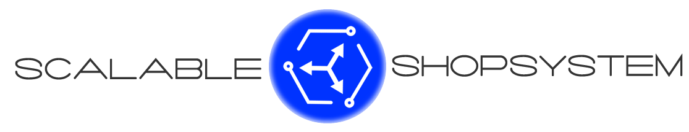

# Prototyp eines skalierbaren Shopsystems - Am Beispiel von Microservices  

## Motivation
Das geplante Shopsystem, das explizit eine hohe Skalierbarkeit aufweisen soll, ist von Grund auf neu zu planen und zu entwickeln. Dies gibt die Möglichkeit, bereits innerhalb der Konzeption entsprechende Maßnahmen zu ergreifen, um dieser Anforderung bestmöglich nachzukommen. Hierfür kann ein sehr aktueller Architekturstil mit entsprechenden Konzepten, Tools und Frameworks zum Einsatz kommen, die zur Erreichung der Zielsetzung führen sollen.

## Problemstellung
Für moderne Systeme, wie Webanwendungen, wird heutzutage häufiger die Forderung nach Skalierbarkeit erhoben. Es gilt hierbei meist die individuelle Analyse, welche Architekturentscheidungen und verfügbaren Mittel den Anforderungen am geeignetsten entgegnen. Außerdem gilt hierbei, dass Skalierbarkeit die Komplexität des Systems in den meisten Fällen erhöht und Probleme entstehen können, die mit einer anderen Architektur ggf. nicht einher gehen. Die Kenntnis über entsprechende Probleme und mögliche Fallstricke fehlen häufig noch in den Unternehmen, um eine entsprechende Architektur zu konzipieren bzw. diese entsprechend umzusetzen. Es werden daher innerhalb dieser Arbeit im Zuge der technischen Konzeption mögliche Fallstricke aufgedeckt und entsprechende Maßnahmen ergriffenen bzw. erläutert.

## Zielsetzung
Im Fokus der Arbeit steht die technische Konzeption und die hierauf aufbauende Implementierung eines prototypischen, hoch skalierbaren Shopsystems. Es wird daher schrittweise ein technisches Konzept erarbeitet, in dem Architektur und entsprechende Entwurfsentscheidungen erläutert sind. Im Zuge der Implementierungen ist zunächst ein generischer Microservice zu entwickeln bzw. eine beispielhafte Vorgehensbeschreibung zur Erstellung eines Microservices bereitzustellen, der die Grundlage für die in den Prototypen verwendeten Services darstellt und darüber hinaus auch in Zukunft für die Erweiterung des Systems durch weitere Services verwendet werden kann. 

## Getting started
    - Check out Services
    - Install Docker (tested on Windows)
    - Run Services in Container
        1. mvn clean package
        2. change directory to <service>-build/target to use the build Fat-Jar
        2. docker build -t <specific_servicename_of_Dockerfile>
        3. docker run -p <port>:<port> -t <specific_servicename_of_Dockerfile>
    - Install NodeJS
    - Install npm & modules
    - Run gulp on storefront